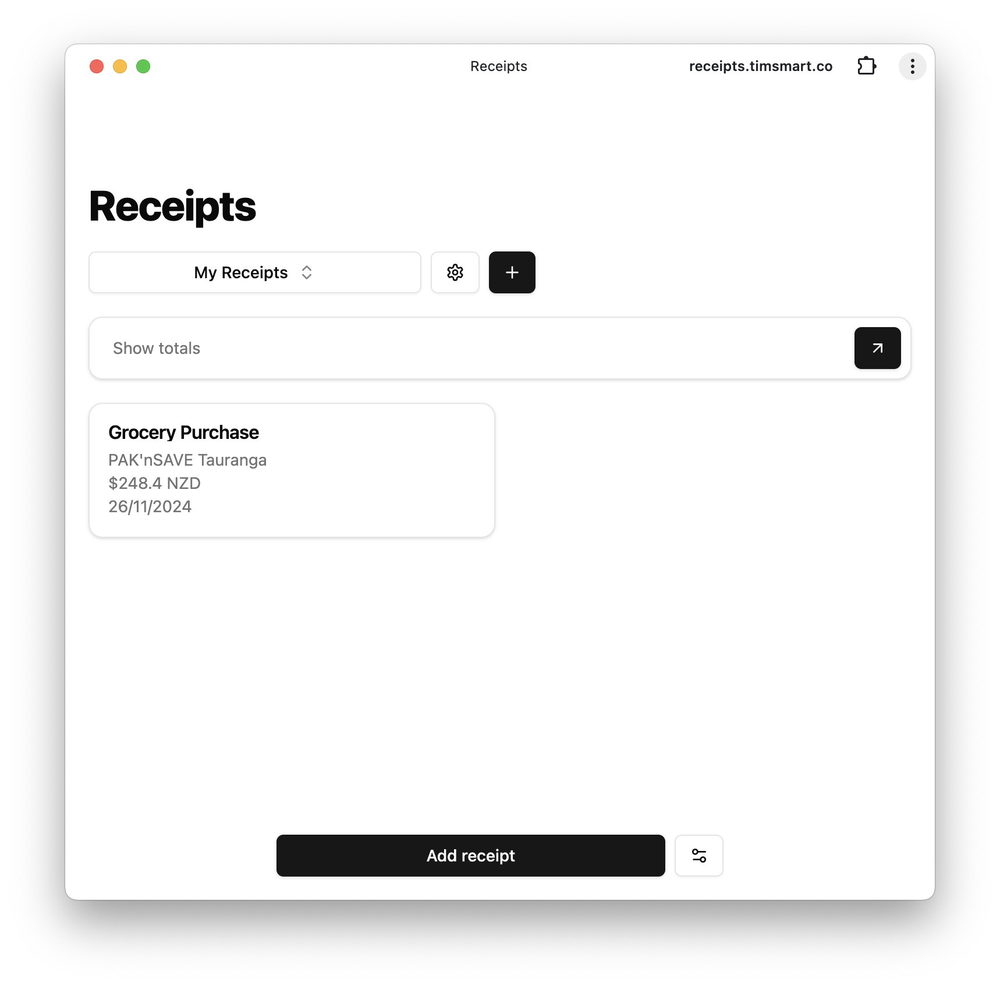

# Receipt scanner + tracker

A simple local-first receipt scanner and tracker.

## Features

- Use OpenAI's GPT-4o to extract information from receipt images.
- Store receipt information in a local SQLite database.
- Supports syncing with a remote server, to share receipts across devices.
- Supports offline mode, with automatic sync when the server is available.
- Install as a PWA on your phone or desktop.

## Installation

1. The client is hosted on Vercel at https://receipts.timsmart.co
2. You can run a remote sync server using Docker: https://hub.docker.com/r/timsmart/effect-eventlog-sqlite

   - `docker run -d -p 3000:3000 -v /path/to/data:/data timsmart/effect-eventlog-sqlite`

3. Set the remote server URL in the client settings.
